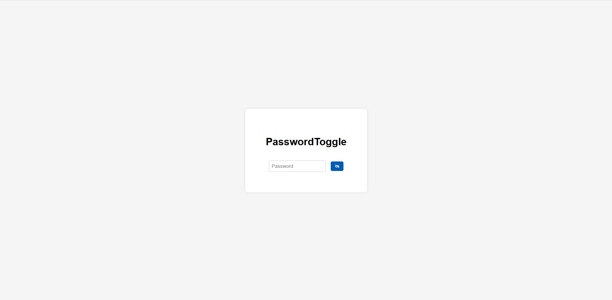
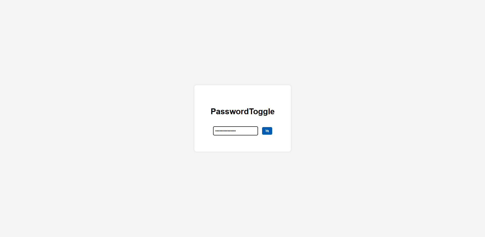

# React Password Toggle 🔐

A simple React component that allows users to show/hide their password using eye icons (`react-icons`).

## 🚀 Features

- Eye toggle with `react-icons`
- Password visibility state with `useState`
- Styled with basic CSS
- Clean layout

## 📸 Screenshot

## 📁 Project Structure

src/
components/
PasswordToggle.js
App.js
App.css

## 🛠️ Installation

npm install
npm start

## 🔧 Technologies Used

React
React Icons
CSS
